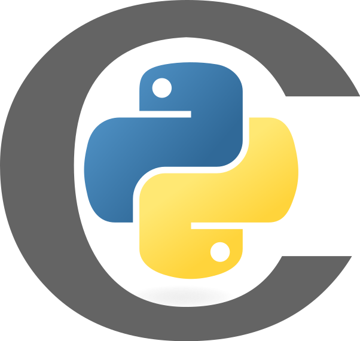

# Welcome on my `Github` profile !

## My repositories by language :

-  [`C`](https://github.com/LouisJustinTALLOT/C)
-  [`C++`](https://github.com/LouisJustinTALLOT/CPP)
-  [`Python`](https://github.com/LouisJustinTALLOT/Python)
-  [`Cython`](https://github.com/LouisJustinTALLOT/Cython)
-  [`Prolog`](https://github.com/LouisJustinTALLOT/Prolog)
-  [`Fortran`](https://github.com/LouisJustinTALLOT/Fortran)
- [`Forth`](https://github.com/LouisJustinTALLOT/Forth)
- [`HTML, CSS, Javascript`](https://github.com/LouisJustinTALLOT/Webdev)

## Here are some projects that I like :

<!--
**LouisJustinTALLOT/LouisJustinTALLOT** is a ✨ _special_ ✨ repository because its `README.md` (this file) appears on your GitHub profile.

Here are some ideas to get you started:

- 🔭 I’m currently working on ...
- 🌱 I’m currently learning ...
- 👯 I’m looking to collaborate on ...
- 🤔 I’m looking for help with ...
- 💬 Ask me about ...
- 📫 How to reach me: ...
- 😄 Pronouns: ...
- ⚡ Fun fact: ...
-->
